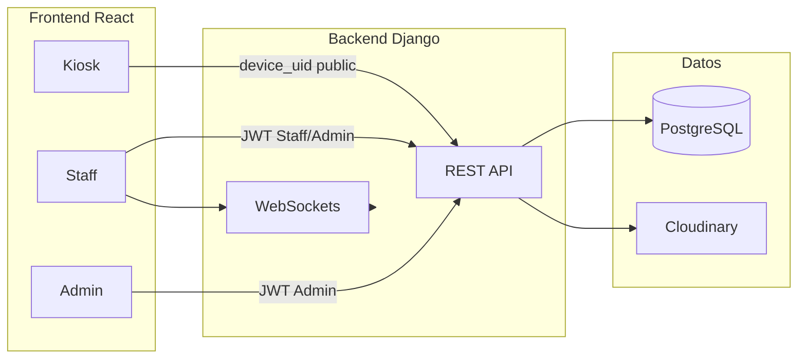
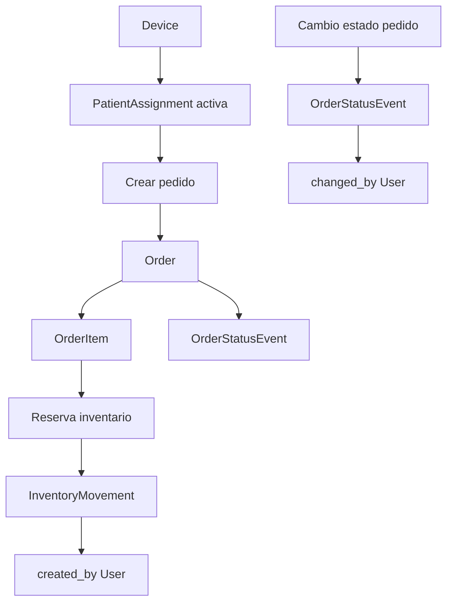

# Documentación del proyecto Clinic Service / CAMSA orientada a GxP (área salud)

Este documento describe la estructura, el desarrollo y los controles del sistema en perspectiva de Buenas Prácticas (GxP) aplicables al área de la salud. No sustituye asesoría legal o regulatoria.

---

## 1. Introducción y alcance GxP

### Objetivo del documento

- Unificar en un solo lugar la visión de **arquitectura**, **estructura** y **desarrollo** del proyecto Clinic Service / CAMSA.
- Exponer los **controles existentes** que apoyan trazabilidad, auditoría y acceso (alineados con expectativas tipo 21 CFR Part 11 y Buenas Prácticas).
- Identificar **brechas** y **recomendaciones** para fortalecer el cumplimiento GxP.

### Alcance del sistema bajo GxP

Se consideran en alcance GxP los procesos y datos que impactan la **atención al paciente** y la **integridad de registros**:

| Área | Procesos / datos | Relevancia GxP |
|------|------------------|----------------|
| Cuentas y acceso | Usuarios, roles, asignación de permisos | Control de acceso, atribución |
| Clínica | Habitaciones, pacientes, dispositivos, asignación paciente–staff–dispositivo | Contexto de atención, trazabilidad |
| Pedidos | Creación, ítems, cambios de estado, cancelación | Registro de solicitudes y cumplimiento |
| Inventario | Balances, movimientos (receipt, adjust, consume, etc.) | Trazabilidad de productos y stock |
| Feedback | Encuestas de satisfacción por asignación/staff | Evidencia de calidad de atención |

El **catálogo** (productos, categorías) se considera dato maestro que sostiene pedidos e inventario; por tanto también dentro del alcance funcional.

### Referencia normativa (orientativa)

- **21 CFR Part 11** (FDA): registros electrónicos, firma electrónica, controles de sistemas cerrados (audit trail, identificación de usuario, marcas de tiempo, etc.).
- **Buenas Prácticas** (GMP/GCP según aplicación): documentación, validación, trazabilidad y control de acceso.

La interpretación legal y el cumplimiento regulatorio deben ser definidos con la organización y, si aplica, con asesoría regulatoria.

---

## 2. Arquitectura y estructura del proyecto

### 2.1 Diagrama de arquitectura

- **Kiosk**: acceso sin autenticación mediante `device_uid`; usa endpoints públicos.
- **Staff / Admin**: autenticación JWT; acceso a APIs protegidas según rol.
- **WebSockets**: actualizaciones en tiempo real (estado de pedidos) para staff.

### 2.2 Backend (Django)

- **Framework**: Django 5.x, Django REST Framework, Simple JWT, Channels (WebSockets), Daphne (ASGI).
- **Base de datos**: PostgreSQL (recomendado); SQLite como fallback en desarrollo.
- **Configuración**: `clinic_service/settings.py`, URLs en `clinic_service/urls.py`.

**Aplicaciones instaladas** (`INSTALLED_APPS`):

| App | Responsabilidad |
|-----|-----------------|
| accounts | Usuario personalizado (email), roles (ADMIN, STAFF), JWT |
| clinic | Habitaciones, pacientes, dispositivos, asignaciones paciente–staff–dispositivo |
| catalog | Categorías y productos (catálogo maestro) |
| inventory | Balance de inventario y movimientos |
| orders | Pedidos, ítems, eventos de cambio de estado |
| feedbacks | Encuestas de satisfacción por asignación |
| report_analytics | Reportes / analíticas |
| common | Utilidades compartidas |

**Convención de URLs** (`clinic_service/urls.py`):

| Prefijo | Descripción | Autenticación |
|---------|-------------|---------------|
| `/admin/` | Panel de administración Django | Sesión admin |
| `/api/health` | Health check | Público |
| `/api/auth/` | Login, me, refresh, logout | Público (login) / JWT (resto) |
| `/api/clinic/` | Rooms, patients, devices, assignments | JWT (Staff/Admin) |
| `/api/catalog/` | Categorías y productos (CRUD) | JWT (Staff/Admin) |
| `/api/inventory/` | Balances y movimientos | JWT (Staff/Admin) |
| `/api/orders/` | Pedidos y operaciones de estado | JWT (Staff/Admin) |
| `/api/feedbacks/` | Listado y gestión de feedbacks | JWT (Staff/Admin) |
| `/api/reports/` | Reportes | JWT (Staff/Admin) |
| `/api/public/` | Catálogo público, pedidos kiosk, paciente activo por dispositivo | Público (device_uid) |

**Estructura típica de una app** (ej. `orders`):

- `models.py` – Modelos de datos
- `serializers.py` – Serialización/validación API
- `views.py` – ViewSets y vistas
- `urls.py` – Rutas de la app
- `admin.py` – Registro en el admin de Django
- `public_urls.py` – Solo en apps que exponen API pública (orders, clinic, catalog)

### 2.3 Frontend (React + Vite + TypeScript)

- **Ubicación**: `frontend/src/`.
- **Routing**: definido en `frontend/src/App.tsx`.

**Estructura de carpetas**:

| Carpeta | Contenido |
|---------|-----------|
| `api/` | Cliente HTTP (axios), módulos por dominio (auth, admin, kiosk, orders, products) |
| `auth/` | AuthContext, ProtectedRoute, AdminProtectedRoute |
| `components/` | Componentes reutilizables (admin, kiosk, staff, store, services) |
| `contexts/` | SurveyContext y otros contextos |
| `hooks/` | useKioskState, useWebSocket, useStoreCart, etc. |
| `pages/` | Páginas por rol: kiosk, staff, admin |
| `types/` | Tipos TypeScript (api, store) |
| `utils/` | Utilidades (imágenes, responsive) |
| `styles/` | Colores, estilos globales |

**Rutas por tipo de usuario**:

- **Kiosk**: `/kiosk`, `/kiosk/:deviceId` (home, categorías, pedidos, store, checkout, servicios, Renova).
- **Staff**: `/staff/login`, `/staff/dashboard`, `/staff/orders`, `/staff/orders/:id`, `/staff/inventory` (protegidas con `ProtectedRoute`).
- **Admin**: `/admin/login`, `/admin/dashboard`, `/admin/users`, `/admin/products`, `/admin/feedback`, `/admin/devices`, `/admin/inventory` (protegidas con `AdminProtectedRoute`).

---

## 3. Modelos de datos y flujos críticos

### 3.1 Cuentas y acceso (accounts)

- **User**: usuario personalizado con `email` como identificador (USERNAME_FIELD), `full_name` opcional.
- **Role**: roles fijos (ADMIN, STAFF) con descripción opcional.
- **UserRole**: relación User–Role con `assigned_at` y `assigned_by` (trazabilidad de quién asignó el rol).

Métodos de ayuda: `user.has_role(role_name)`, `user.get_roles()`.

### 3.2 Clínica (clinic)

- **Room**: código único, piso, activo; `created_at` / `updated_at`.
- **Patient**: nombre, teléfono E.164, email opcional, activo.
- **Device**: identificador único (`device_uid`), tipo (IPAD/WEB/OTHER), habitación, staff asignado (M2M), activo, `last_seen_at`.
- **PatientAssignment**: relación activa paciente–staff–dispositivo–habitación; `order_limits` (JSON por tipo de categoría), `survey_enabled`, `can_patient_order`, `started_at`, `ended_at`, `is_active`.

### 3.3 Pedidos (orders)

- **Order**: referencia a Device, PatientAssignment, Room, Patient; estado (PLACED, PREPARING, READY, DELIVERED, CANCELLED); `placed_at`, `delivered_at`, `cancelled_at`.
- **OrderItem**: Order, Product, cantidad, `unit_label` (copia del rótulo de unidad en el momento del pedido).
- **OrderStatusEvent**: auditoría de cambios de estado: `order`, `from_status`, `to_status`, `changed_by` (FK User), `changed_at`, `note`.

### 3.4 Inventario (inventory)

- **InventoryBalance**: uno por producto; `on_hand`, `reserved`, `reorder_level`; propiedad `available` (on_hand - reserved).
- **InventoryMovement**: producto, tipo (RECEIPT, ADJUSTMENT, WASTE, RESERVE, RELEASE, CONSUME), cantidad, `order` (FK opcional), `created_by` (FK User), `note`, `created_at`.

### 3.5 Catálogo (catalog)

- **ProductCategory**: nombre, tipo (DRINK, SNACK, FOOD, OTHER), orden, configuración carrusel, activo.
- **Product**: categoría, nombre, descripción, imagen/URL, SKU (autogenerado si no se informa), `unit_label`, precio (opcional), tags, beneficios (JSON), activo.

### 3.6 Feedback (feedbacks)

- **Feedback**: vinculado a PatientAssignment, Room, Patient, Staff; `product_ratings` (JSON), `staff_rating`, `stay_rating`, comentario, `created_at`.

### 3.7 Diagrama de flujo crítico (pedidos e inventario)

---

## 4. Controles GxP existentes (qué documentar)

### 4.1 Trazabilidad

| Elemento | Implementación |
|----------|----------------|
| Pedido → contexto | Order vinculado a PatientAssignment, Device, Room, Patient |
| Snapshot de ítems | OrderItem guarda `unit_label` en el momento del pedido |
| Cambios de estado | OrderStatusEvent con `from_status`, `to_status`, `changed_by`, `changed_at`, `note` |
| Movimientos de inventario | InventoryMovement con `created_by`, `order` (opcional), `movement_type`, `note`, `created_at` |
| Asignación de roles | UserRole con `assigned_by`, `assigned_at` |

### 4.2 Control de acceso

| Elemento | Implementación |
|----------|----------------|
| Autenticación | JWT (access + refresh); backend con EmailBackend |
| Permisos API | Clases en `accounts/permissions.py`: IsStaffOrAdmin, IsAdmin, IsStaff, IsSuperAdmin |
| Endpoints públicos | Solo los necesarios para kiosk: creación de pedidos y consulta de paciente activo por `device_uid`; catálogo público de solo lectura |
| Frontend | Rutas protegidas con ProtectedRoute (staff) y AdminProtectedRoute (admin); token en cabecera vía cliente en `frontend/src/api/client.ts` |

### 4.3 Integridad y consistencia

| Elemento | Implementación |
|----------|----------------|
| Transacciones | Uso de `transaction.atomic()` en creación de pedidos y cambios de estado (orders/views.py) |
| Validadores | Teléfono E.164 (Patient), MinValueValidator en cantidades, opcionalmente MaxValue en ratings |
| Integridad referencial | Uso de PROTECT/CASCADE/SET_NULL según política (p. ej. OrderItem.product PROTECT) |

### 4.4 Marcas de tiempo

- Campos `created_at` y `updated_at` en modelos principales.
- Eventos de auditoría con `auto_now_add=True` (OrderStatusEvent.changed_at, InventoryMovement.created_at).
- Zona horaria del servidor configurada en `settings.py` (`TIME_ZONE`, `USE_TZ`) para consistencia.

---

## 5. Desarrollo: entorno, APIs y frontend

### 5.1 Puesta en marcha del proyecto

- **Guías**: [README_PROYECTO.md](README_PROYECTO.md), [INSTALL.md](INSTALL.md), [QUICKSTART.md](QUICKSTART.md).
- Pasos habituales: instalar dependencias (`pip install -r requirements.txt`), copiar y configurar `.env`, crear BD PostgreSQL, ejecutar migraciones (`python manage.py migrate`), `python manage.py seed_roles`, `python manage.py createsuperuser`, `python manage.py runserver`.
- Frontend: desde `frontend/`, `npm install` y `npm run dev` (Vite).

### 5.2 Variables de entorno críticas

| Variable | Uso | GxP / seguridad |
|----------|-----|------------------|
| SECRET_KEY | Django | Mantener secreta en producción |
| DEBUG | Modo depuración | False en producción |
| DATABASE_URL / DB_* | Conexión PostgreSQL | Control de acceso a BD |
| CORS_ALLOWED_ORIGINS | Orígenes permitidos | Restringir en producción |
| JWT | Simple JWT (por defecto en settings) | Expiración access/refresh |
| CLOUDINARY_* | Almacenamiento de medios | Credenciales seguras |
| CHANNEL_LAYERS_* | Redis para WebSockets | Opcional según despliegue |

Ver `.env.example` y documentación de despliegue ([DEPLOY_RAILWAY.md](DEPLOY_RAILWAY.md), [RAILWAY_SETUP.md](RAILWAY_SETUP.md)).

### 5.3 Resumen de APIs

| Área | Prefijo | Permisos | Documentación de referencia |
|------|---------|----------|-----------------------------|
| Auth | `/api/auth/` | Login público; me/refresh/logout con JWT | [JWT_AUTH_GUIDE.md](JWT_AUTH_GUIDE.md) |
| Clinic | `/api/clinic/` | Staff/Admin | [CLINIC_API.md](CLINIC_API.md) |
| Catalog | `/api/catalog/` | Staff/Admin | [CATALOG_API.md](CATALOG_API.md) |
| Inventory | `/api/inventory/` | Staff/Admin | [INVENTORY_API.md](INVENTORY_API.md) |
| Orders | `/api/orders/` | Staff/Admin | README_PROYECTO (tabla de endpoints) |
| Feedback | `/api/feedbacks/`, `/api/public/feedbacks/` | Staff/Admin o público (crear) | Incluido en documentación del proyecto |
| Reports | `/api/reports/` | Staff/Admin | report_analytics |
| Public (kiosk) | `/api/public/` | Público (device_uid) | README_PROYECTO, public_urls |

### 5.4 Frontend: cliente API y rutas protegidas

- Cliente base: `frontend/src/api/client.ts` (axios, base URL desde `VITE_API_BASE_URL`, interceptor con Bearer token, reintento con refresh token).
- Módulos: `auth.ts`, `admin.ts`, `kiosk.ts`, `orders.ts`, `products.ts`.
- Rutas protegidas: `ProtectedRoute` para staff, `AdminProtectedRoute` para admin; redirección a login si no hay sesión válida.

---

## 6. Brechas y recomendaciones GxP

### 6.1 Brechas conocidas

| Brecha | Descripción |
|--------|-------------|
| Audit trail global | No existe una pista de auditoría genérica para todos los cambios de datos (solo OrderStatusEvent e InventoryMovement registran quién/cuándo de forma explícita). |
| Firma electrónica | No se implementa firma electrónica (21 CFR Part 11) para acciones críticas. |
| Historial completo de cambios | Ediciones y borrados en modelos (Room, Patient, Product, etc.) no generan historial de valores anteriores. |
| Inmutabilidad del audit trail | Los registros de OrderStatusEvent e InventoryMovement no están formalmente protegidos contra modificación/borrado (más allá de permisos de base de datos). |
| Retención y exportación | No hay política documentada ni funciones específicas para retención y exportación de audit trail para inspección. |

### 6.2 Recomendaciones de mejora

| Recomendación | Prioridad |
|---------------|-----------|
| Implementar un **audit log global** (p. ej. modelo o middleware) que registre creación/actualización/eliminación de entidades críticas con usuario, timestamp y valores antiguos/nuevos. | Alta |
| Definir **política de retención** del audit trail y capacidad de **exportación** en formato legible y electrónico para auditorías. | Alta |
| Evaluar necesidad de **firma electrónica** para acciones definidas como críticas (cambio de estado, ajustes de inventario, asignación de roles). | Media |
| Proteger tablas de auditoría contra **edición/borrado** (permisos, triggers o capa de solo escritura) y documentar el diseño. | Media |
| Documentar y ejecutar **validación del sistema** (IQ/OQ/PQ) si el sistema se considera validable según procedimientos internos. | Según política |
| Revisar **backups, recuperación y continuidad** y documentarlos para soporte GxP. | Alta |

---

## 7. Índice de documentación existente

Documentos en `documentacion/` útiles para desarrollo y soporte GxP/auditoría:

| Documento | Uso recomendado |
|-----------|------------------|
| [README_PROYECTO.md](README_PROYECTO.md) | Visión general, quick start, endpoints, modelos principales |
| [README.md](README.md) | Configuración inicial y comandos |
| [INSTALL.md](INSTALL.md) | Instalación paso a paso |
| [QUICKSTART.md](QUICKSTART.md) | Arranque rápido |
| [JWT_AUTH_GUIDE.md](JWT_AUTH_GUIDE.md) | Autenticación JWT y uso en API |
| [ROLES_SYSTEM.md](ROLES_SYSTEM.md) | Roles (ADMIN, STAFF) y permisos |
| [CUSTOM_USER_SETUP.md](CUSTOM_USER_SETUP.md) | Configuración del usuario personalizado |
| [CLINIC_API.md](CLINIC_API.md) | API de clinic (rooms, patients, devices) |
| [CATALOG_API.md](CATALOG_API.md) | API de catálogo (categorías, productos) |
| [INVENTORY_API.md](INVENTORY_API.md) | API de inventario (balances, movimientos) |
| [DATABASE_CONFIG.md](DATABASE_CONFIG.md) | Configuración de base de datos |
| [SETUP_DATABASE.md](SETUP_DATABASE.md) | Setup detallado PostgreSQL |
| [ADMIN_TESTING_GUIDE.md](ADMIN_TESTING_GUIDE.md) | Pruebas desde el admin |
| [DEPLOY_RAILWAY.md](DEPLOY_RAILWAY.md) | Despliegue en Railway |
| [RAILWAY_SETUP.md](RAILWAY_SETUP.md) | Configuración Railway |
| [WEBSOCKETS.md](WEBSOCKETS.md) | WebSockets y tiempo real |
| **DOCUMENTACION_GXP_DESARROLLO.md** (este documento) | Estructura, desarrollo y controles GxP |

Scripts de utilidad (creación de BD, roles, usuarios, diagnósticos) se encuentran en `documentacion/scripts/`.

---

**Versión del documento:** 1.0  
**Última actualización:** Enero 2025
